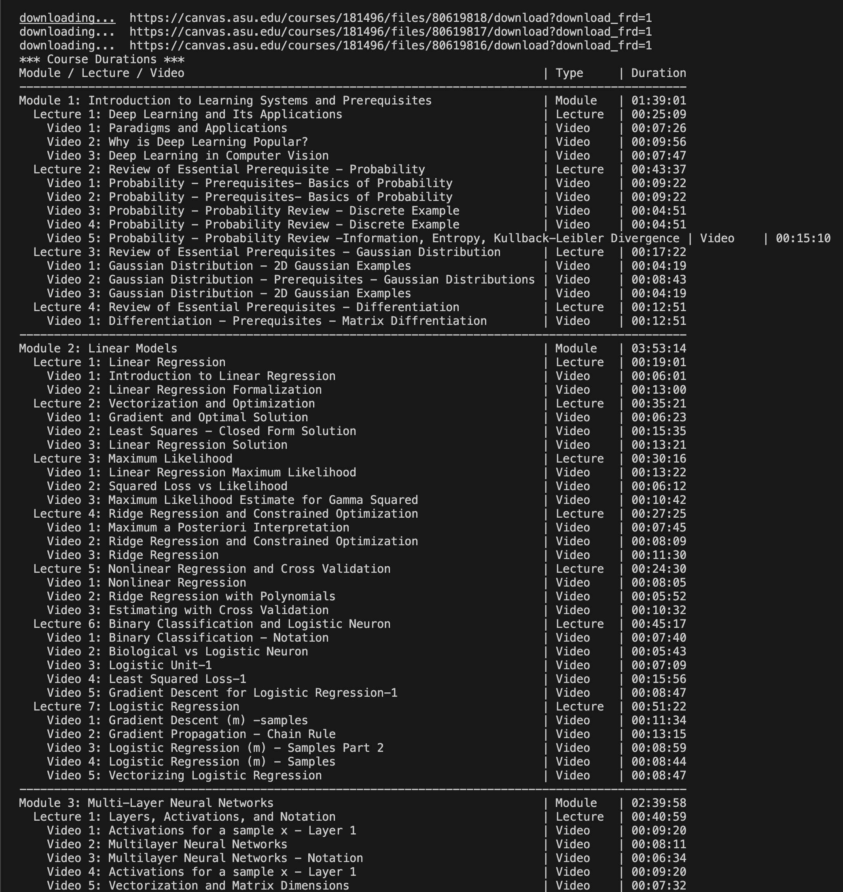
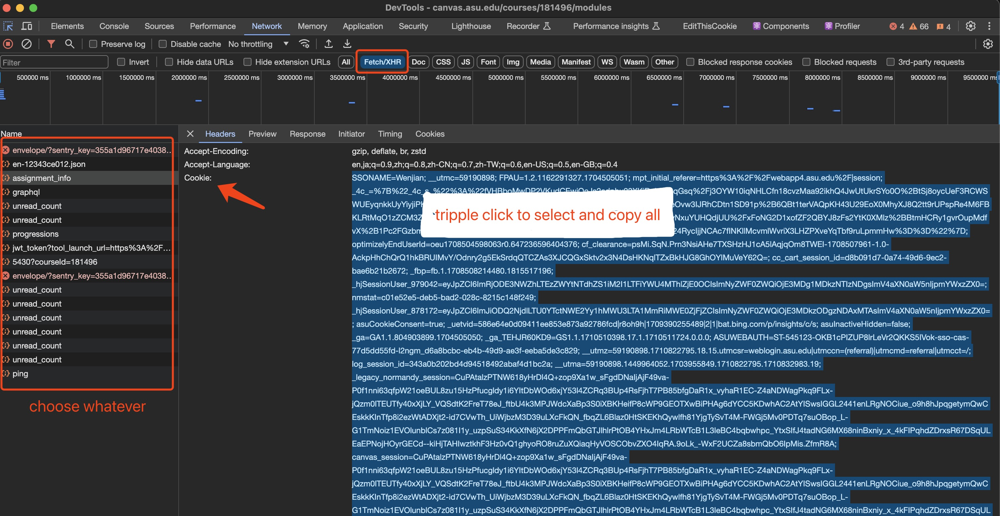

# Canvas Schedule Helper

This Python script calculates the total duration of all videos in a course hosted on the Canvas Learning Management System. It is designed to help students plan their study time more efficiently by giving them an idea of how long it will take to go through course materials.

## Example output


## Usage

### Prerequisites 

- Python 3

### Installation

1. **Clone the Repository**: First, clone this repository to your local machine using git:

    ```bash
    git clone https://github.com/daringcalf/canvas-schedule-helper.git
    cd canvas-schedule-helper
    ```

2. **Install Dependencies**: Inside the cloned directory, install the required Python packages using:

    ```bash
    pip install -r requirements.txt
    ```

### Running the Script

To use this script, you must provide the course id and the cookies from your browser. 

1. **Obtain Cookies**: Navigate to your Canvas course page in your web browser. You'll need to retrieve your session cookies. 


2. **Execute the Script**: Run the script with the required parameters (course URL and cookies). Make sure to replace `<CourseId>` with the actual URL of your Canvas course and `<Cookies>` with your session cookies obtained in the previous step.`<CourseId>` is the number in the course url, for example `181496` is `<CourseId>` for `https://canvas.asu.edu/courses/181496/modules`

    ```bash
    python main.py course_id='<CourseId>' cookies='<Cookies>'
    ```

## Contributing

Feel free to dive in! [Open an issue](https://https://github.com/daringcalf/canvas-schedule-helper/issues/new) or submit PRs. 

### Steps to Contribute

- Fork the repo on GitHub
- Clone this project to your own machine
- Commit changes to your own branch
- Push your work back up to your fork
- Submit a Pull request so that your changes can be reviewed

## License 

Distributed under the MIT License. See `LICENSE` for more information.

## Acknowledgments

This tool was created to help students manage their study time more effectively. If you find it helpful, please consider giving it a star. Your support means a lot!